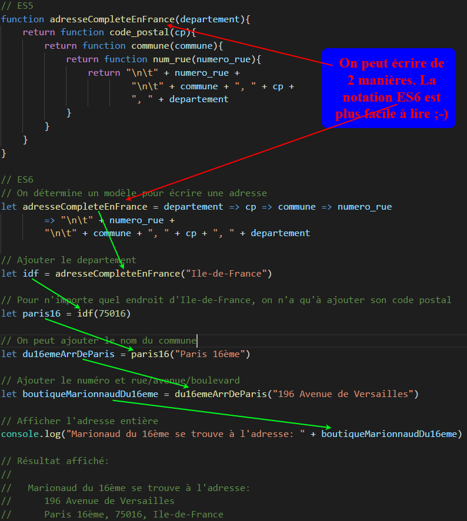

# JavaScript: Composition de Fonction et Callback

## Callback
> En JavaScript, on peut créer une function puis de la passer à une autre (**SANS** les parenthèses), en tant que paramètre. On appelle la première fonction une "**callback**" function. Généralement, on fait ce genre de manipulation en mode ASYNCHRONISE (**asyn**). Par exemple, lorsqu'on veuille traiter des données (afficher par exemple) mais on doit attendre d'avoir le résultat des maniputations qui prennent un certain temps avant d'arriver (d'une requête de la base de données ou de l'ouverture d'un fichier, par exemple). Donc, pour renvoyer des résultats - lorsqu'ils sont arrivés - à une fonction passée en paramètre, la fonction appelante n'a qu'à retourner la fonction appelée en lui donnant les résultats en tant que paramètre (en ajoutant des PARENTHESES, on EXECUTE la fonction).

### Voici un exemple de l'utilisation de "**callback**" fonction

---

## Composition de Fonctions - Généralisation par exemple

### Supposons qu'on ait plusieurs addresse dans le 16ème arrondissement. On peut faire, sans avoir rien d'autre à faire :

> let adresse1 = du16emeArrDeParis("1 rue Renard");  
> let adresse2 = du16emeArrDeParis("25 rue du Loup");  
> let adresse3 = du16emeArrDeParis("60 rue Elephant");

