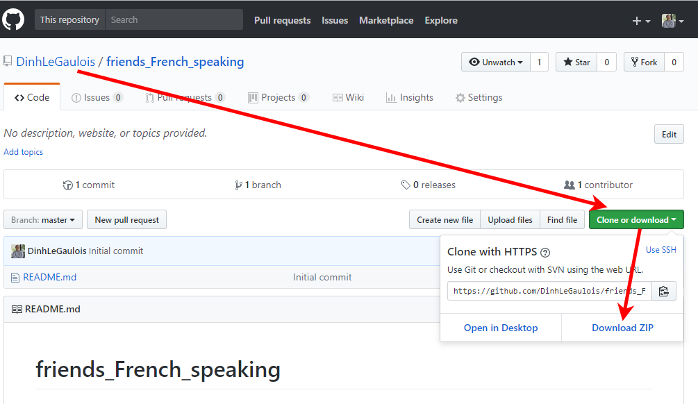

# Je vous salue mes amis d'Iles-de-France
## But
> * Ayant un mal fou à vous faire parvenir mes applications *via* des envois par email (à cause des fichiers JavaScript, je pense), vous pouvez les télécharger en sélectionnant "**Clone or Download**" puis "**Download Zip**"
> * Je ne mets que des fichiers "traités" (avec "**bundle.js**" qui est un fichier compilé regroupant tous les "**script**", "**fonction**", etc. du projet). Donc, vous n'avez qu'à cliquer sur le fichier "**index.html**" pour voir le résultat. Afin d'avoir le code source (principalement en **JavaScript**), vous n'avez qu'à parcourir mon compte **Github** (j'ai mis des liens correspondants dans la liste en bas).
> * Aucune application n'a de "**business layer**" ou de base de données (pour cette dernière, on peut utiliser des outils en ligne comme "**mLab**", "**fireBase**", mais il faut avoir des clés d'accès, pas très pratique pour des testeurs qui ne sont pas informaticiens), mais je ne sais pas (encore) comment faire pour avoir le "**business layer**" sans avoir à démarrer un serveur ("**Express/Node**" ou "**JBoss**" - pour le monde du Java - par exemple). Le but ici est de n'avoir rien à faire - pour deux qui n'êtes pas programmeurs, par exemple - pour exécuter le programme à part de cliquer sur le fichier "**index.html**" ... 

## Pour ceux qui ne sont pas familiers avec Github

## List des programmes:

> 1) "**Calculatrice**" ([code source](https://github.com/DinhLeGaulois/calculator_react_redux))
> Juste une basique calculatrice faisant 4 opérations arithméthiques. Cela dit, c'est un projet très intéressant pour pratiquer l'architecture de **React/Redux**.

> 2) "**Activités**" ([code source](https://github.com/DinhLeGaulois/activities_react_redux))
> J'ai mis le calcul d'**Indice Masse Corporelle** (**BMI**) et la requête de données à la bibliothèque du congrès (accès libre) ensemble. Pourtant les deux parties sont complètement indépendantes l'un de l'autre. Je vais les faire apparaître par ces cliques des boutons ("tab" ou "link") corespondants.

> 3) "**Ajouter un peu de couleurs**" ([code source](https://github.com/DinhLeGaulois/colors_react_redux))
> Cette application n'a d'intérêt que pour apprendre l'architecture **React/Redux** (puisqu'avec UN seul fichier **HTML** combiné avec un peu de **jQuery**, on peut obtenir le même résultat au lieu des dizaines dans le cas présent). L'enjeu est d'avoir des mises-à-jour correctement des données affichées sous conditions. Pour chaque groupe (boutons, "div" pour l'affichage d'une couleur précise, etc.), on n'a qu'un seul composant réutilisable (**component** ou **fonction** - i.e **state** ou **stateless** selon nos besoins - dans le langage **React**).

> 4) "**JavaScript - Composition de Fonctions**" ([code source](https://github.com/DinhLeGaulois/friends_French_speaking/tree/master/JavaScript%20-%20Composition%20de%20Fonctions))
> La composition des fonctions est très intéressante et facile à faire avec JavaScript ...

---

## Author
* Dinh HUYNH - All Rights Reserved!
* dinh.hu19@yahoo.com